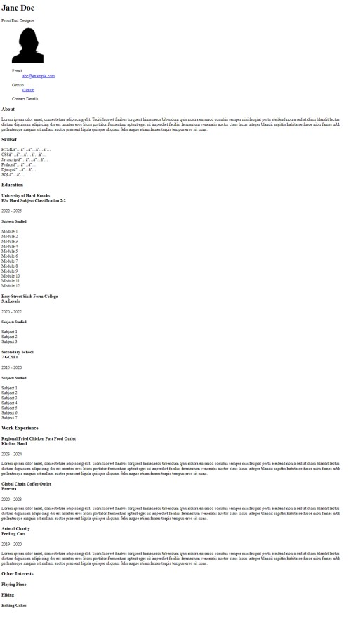
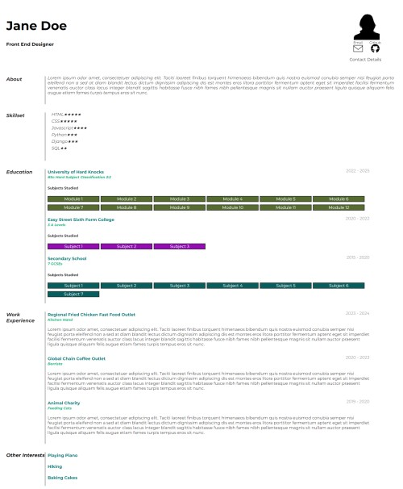

# CSS EXERCISE

CSS will change a drab looking document into something modern and stylish. The exercise provided here asks you to a 
take a CV type document and improve its layout, typography and appearance through the use of CSS.

The document is already marked up with class and id attributes. 

A couple of css files are linked into the starter file - normalize (https://necolas.github.io/normalize.css/), a
defacto go to css library that resets default browser styling to something more modern. And a short style rule that
will add some star(*) rating values to skills.

The rest is for you to explore.

Please note the END image is a suggestion - you are free to explore.

# Start and End Images

|        Start        |         End          |
|:-------------------:|:--------------------:|
|       |       |

