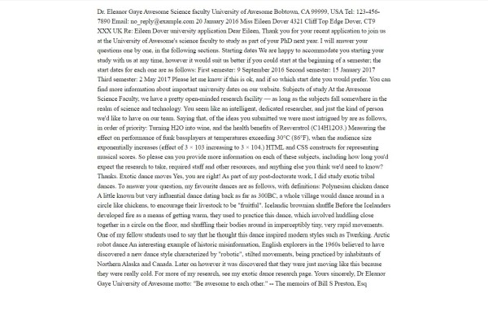
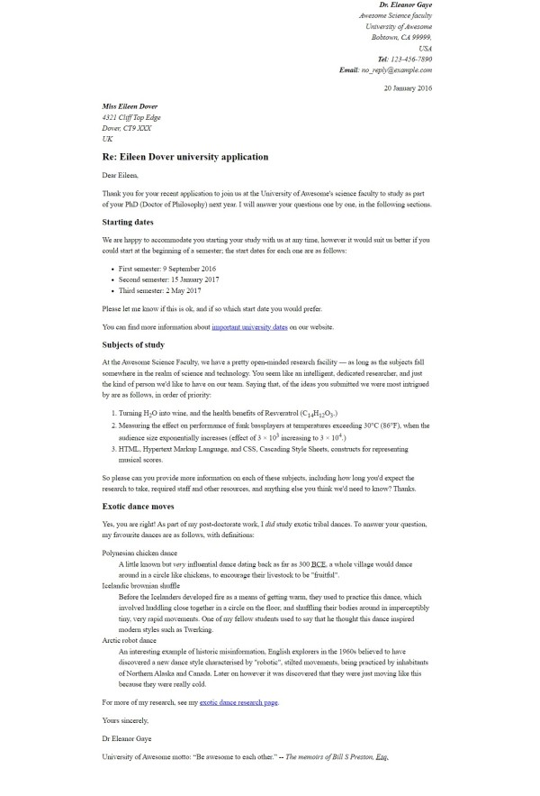

# HTML MARK UP EXERCISE

MDN (Mozilla Developer Network) provides a vast array of material on HTML and CSS. One of these is a mark up exercise.
In the exercise they provide a sample letter as text and asks that it is marked up as HTML

Have a go at this exercise. Rather than a txt file being the starting point. The letter has been added (with no markup) 
to the &lt;body&gt; element of an .html file in this folder. The &lt;head&gt; element includes some styles that can be used.

The images below show the start file and a suggested end point viewed in a browser:

# Start and End Images

|        Start        |         End          |
|:-------------------:|:--------------------:|
|       |       |

## HINT:

The style rules in the &lt;head&gt; element will provide a list of some of the elements being used + there is attribute defined
with a text-align right style. Consider where these will be used in the document. In addition, you will find that the following
elements will appear, if the document is correctly marked up:

- &lt;strong&gt;
- &lt;br&gt; 
- &lt;time&gt;
- &lt;a&gt;
- &lt;sub&gt;
- &lt;sup&gt;
- &lt;abbr&gt;
- &lt;em&gt;
- &lt;cite&gt;

