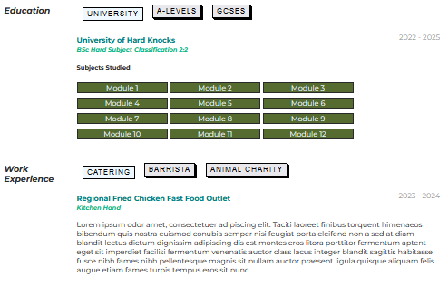

# JAVASCRIPT EXAMPLE

Javascript provides client side functionality and interactivity. Combined with the Document Object Model (DOM), 
it allows for elements, classes and ids to be individually selected and/or grouped together, and behaviour attached 
to them.

The example provided here uses the CV example from earlier. The education and work experience sections have been 
made into buttons that will load content up. Two approaches are demonstrated here; one that creates a new http 
request that returns html that is inserted into an element, and the second that uses style rules to hide and 
display content that is already on the page.

In practice, for an example like one shown, all the content would be downloaded to begin with and then (un)hidden. 
The loading of content via **fetch** is included to demonstrate how lots of websites work which interact with apis 
- i.e. json and/or other content, is requested from a client, and then at the client side this is built into html 
and then inserted into an existing page. This helps to reduce server workload and moves the responsibility onto 
the client to render out the content. 

As additional work throughout your portfolio exercises, look to ask the question, 'can some further interactivity 
be added with some javascript?', and if so, how would this be done. Then look to try it out.

# Screenshot

|        Education and Work Experience sections        |
|:----------------------------------------------------:|
|                                        |