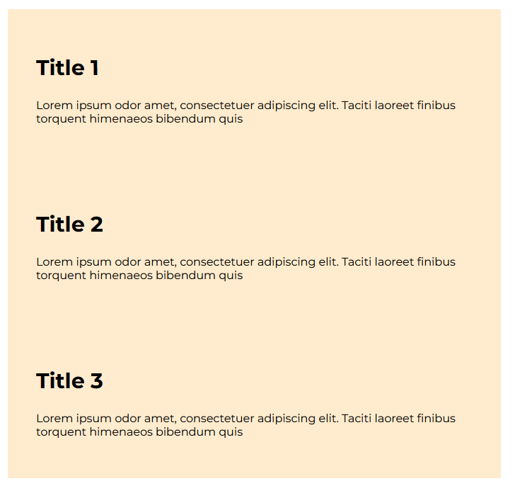

## One approach to the CV exercise: 

### Thinking in blocks

There is no quick solution to CSS – the more practice you have, the more you will get used to recognising  patterns in layouts. 

In general the best approach is to break a task down into smaller tasks and do those tasks separately and finally combine. 

For the CV exercise, I view it as 5 tasks. The order isn’t necessarily important, but that final the solution consists of them. 

### Step 1

The general layout is a header and 5 sections. This can be done with some basic elements and style rules. 

 

### Step 2

Each section has 2 parts – the title and some content. This can be first attempted as a stand alone file.

 

### Step 3

### Step 4

The content element generally contains a list of elements. Use a block to represent an item, but work out the rules to display as a list. 

### Step 5

There is one final element that doesn’t have styles based on any of the above steps. Do that one in a separate file: 

Once you know how all the individual elements can be styled – it is then working out which elements will have certain class and id names in the main file. 

 

 

Work in blocks and build from there. 